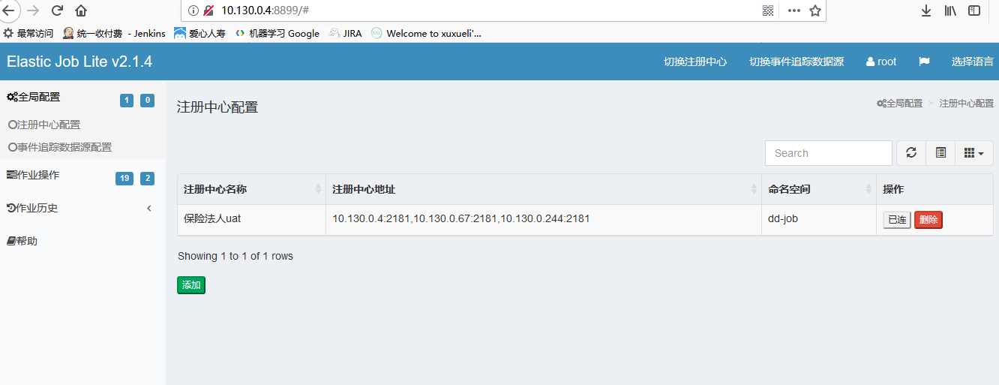

>elastic-job-lite

   
1.  [官网地址](http://elasticjob.io/docs/elastic-job-lite/00-overview/)  和  [官网样例](https://github.com/elasticjob/elastic-job-example)

2. 功能列表

    ```
    * 分布式调度协调
    * 弹性扩容缩容
    * 失效转移
    * 错过执行作业重触发
    * 作业分片一致性，保证同一分片在分布式环境中仅一个执行实例
    * 自诊断并修复分布式不稳定造成的问题
    * 支持并行调度
    * 支持作业生命周期操作
    * 丰富的作业类型（simple、dataflow、script）
    * Spring整合以及命名空间提供
    * 运维平台
    ```
3. 关键代码说明(Springboot)
   ```
   *  业务分片逻辑 select * from test where id/5 = 3
      数据列除以总分片数 等于 当前分片项 ，业务根据这个逻辑进行分片，在多台机器上运行
   *  xml配置 event-trace-rdb-data-source="dataSource"
      指定任务运行日志，入数据库
   *  xml配置 job-exception-handler="top.zanghongmin.elasticjob.config.DefaultJobExceptionHandler"
      执行任务异常处理类，可实现邮件通知
   *  xml配置 sharding-total-count="10"
      配置总分片数为10，如果启动两个实例，每个实例各运行5个分片，停止一个实例，另一个实例会自动运行全部10个实例
   *  xml配置 <job:listener class="top.zanghongmin.elasticjob.config.MyElasticJobListener"/>
      对任务的监听，开始运行和结束任务时运行自定义代码
   ```   
4. 任务管理页面
 

    

