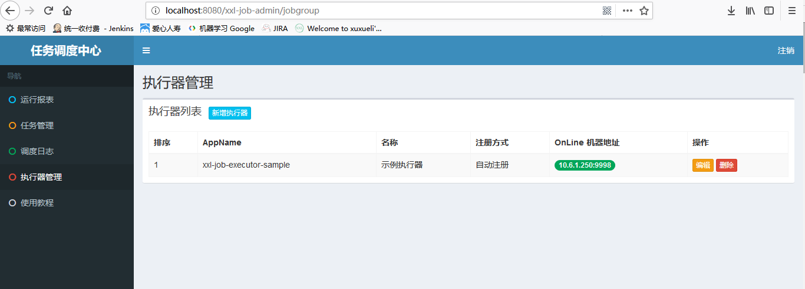

>xxl-job

   
1.  [官网地址](http://www.xuxueli.com/xxl-job/#/)  和  [集成样例](https://github.com/xuxueli/xxl-job/)

2. 概述

    ```
    XXL-JOB是一个轻量级分布式任务调度平台，其核心设计目标是开发迅速、学习简单、轻量级、易扩展。
    现已开放源代码并接入多家公司线上产品线，开箱即用。 
    ```
3. 关键代码说明(Springboot)
   ```
   *  下载源码（两个部分admin和Executor）
      admin：管理页面、调度中心
      executor：执行器（写具体业务代码）
   *  启动admin
      初始化导入数据表(源码中有)
      修改数据库信息，springboot工程启动
      登陆http://localhost:8080/xxl-job-admin
      "执行器管理" 添加执行器即executor工程中的xxl.job.executor.appname等信息
   *  启动executor
      配置xxl.job.executor.appname信息，与admin中一致
      配置xxl.job.admin.addresses信息，admin地址
      springboot工程启动即可
   *  executor代码
      XxlJobConfig类中新建Bean(XxlJobSpringExecutor),初始化start方法与admin进行连接
      Job任务集成IJobHandler接口和@JobHandler(value="demoJobHandler")注解
   ```
4. admin管理页面
 

    

